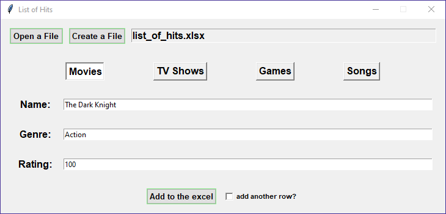
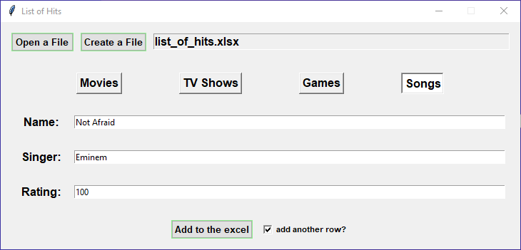

# excel-for-friends

Share your list with friends!

## Index

- [Screenshot](#screenshot)
- [Requirements](#requirements)
- [General](#general)
- [ToDo](#todo)
- [Other](#other)

## Screenshot

## Requirements

* install
  ``
  pip install -r requirements.txt
  ``

## General

* After fill the row to your Excel file. It will add automatically column **Watched** or **Played** or **Heard**. For
  your friends that they can **track** this list.
* You can fill in these lists:
    1) **Movies** (Name, Genre, Your Rating, Watched)
    2) **TV Shows** (Name, Genre, Your Rating, Watched)
    3) **Games** (Name, Genre, Your Rating, Played)
    4) **Songs** (Name, Singer, Your Rating, Heard)

## ToDo

- [x] Add GUI
- [ ] Add option to send list with an email

## Other

* If you find any issue, please don't hesitate to report it
  via [Issues](https://github.com/Fearplay/excel-for-friends/issues)
* If you have an idea to improve this game, please don't hesitate to create pull request
  via [Pull requests](https://github.com/Fearplay/excel-for-friends/pulls)
* Thanks to all :green_heart:

[Back to TOP](#excel-for-friends)